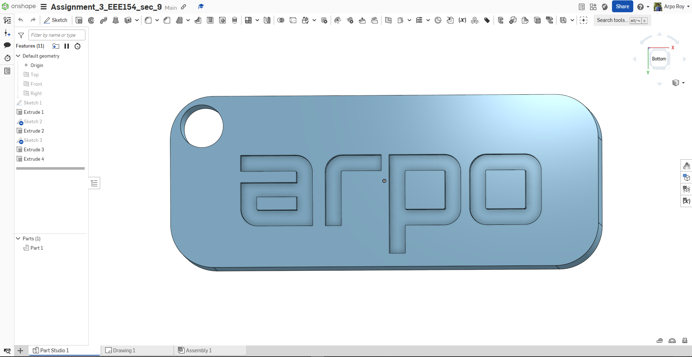
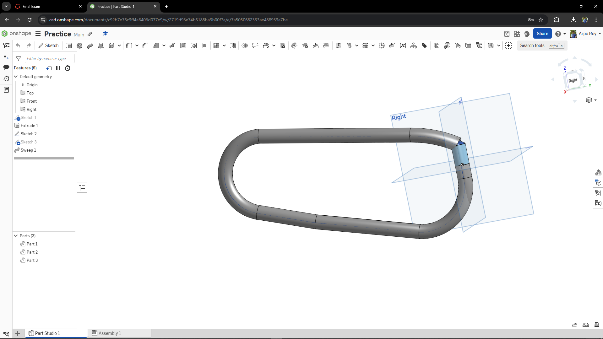
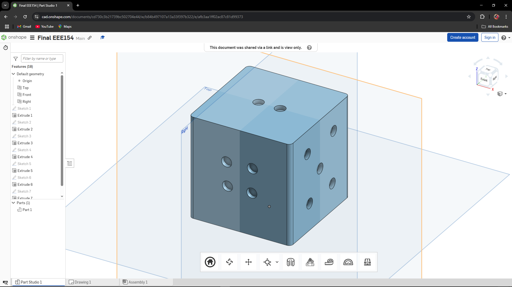
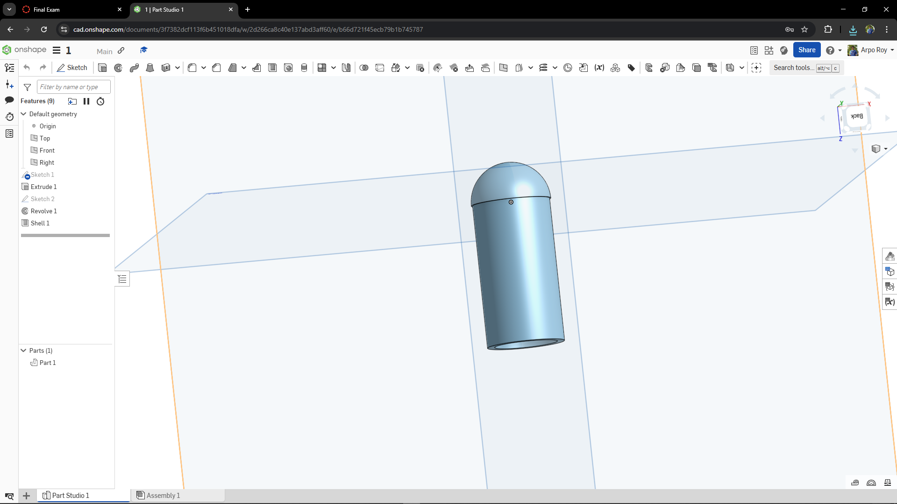
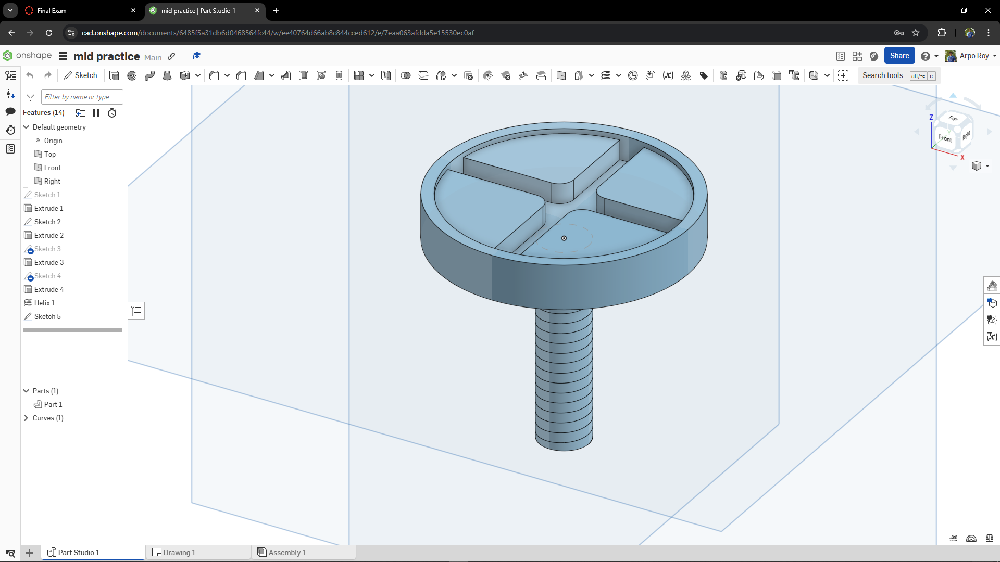
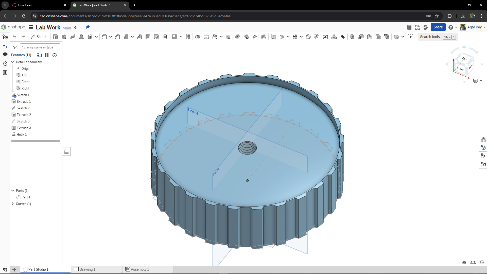
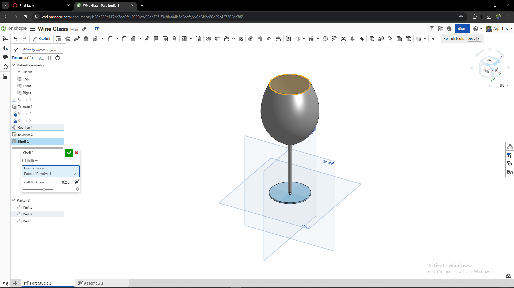
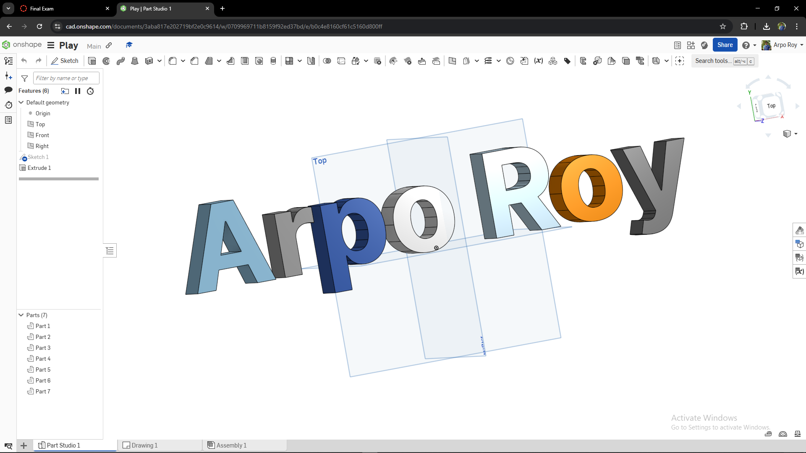
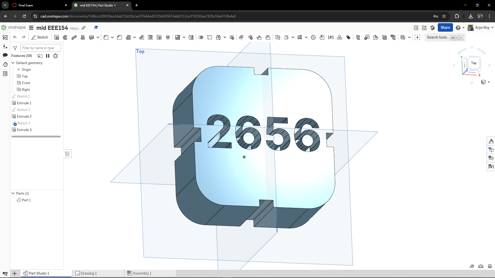

# Onshape EDU Work

Welcome to my ***Onshape Engineering Drawing Repository***!  
This collection showcases various 3D models and engineering designs created using [Onshape](https://www.onshape.com/). Each file represents a different component or object that demonstrates CAD skills, creativity, and precision.

## 📸 Previews

Below are previews of each project, along with links to view or edit them directly on Onshape:

### 🔗 [Key Rings](https://cad.onshape.com/documents/4ded925b7da29fc4b816e180/w/0badd9c56b6555ed446f5350/e/d1938f08cad0498b1530a2a0?renderMode=0&uiState=680a8636cb982f3359c6a24b)

### 🔗 [Key Rings 2](https://cad.onshape.com/documents/c92b7e76c3ff4a6406d077e9/w/2719d93e74b6188ba3b00f7a/e/7a5050682333ae488933a7be?renderMode=0&uiState=680a868acb982f3359c6a2c8)

### 🔗 [Dies](https://cad.onshape.com/documents/cd730c3b21739bc502704e44/w/b84b497107a13a33f397b322/e/afb3aa1ff02ac87c81d99373?renderMode=0&uiState=680a0c996c12993dd3b9281f)

### 🔗 [Bullet](https://cad.onshape.com/documents/3f7382dcf113f6b451018dfa/w/2d266ca8c40e137abd3aff60/e/b66d721f45ecb79b1b745787?renderMode=0&uiState=680a86a1cb982f3359c6a2ed)

### 🔗 [Screw](https://cad.onshape.com/documents/6485f5a31db6d0468564fc44/w/ee40764d66ab8c844cced612/e/7eaa063afdda5e15530ec0af?renderMode=0&uiState=680a86c5cb982f3359c6a324)

### 🔗 [Gear](https://cad.onshape.com/documents/187dc6c59df10381ffa58e8b/w/eaa8e47a3b3ad0a1684c8ede/e/9726c74bc7326e9d2a256faa?renderMode=0&uiState=680a86e2d7bede229cc0454d)

### 🔗 [Wine Glass](https://cad.onshape.com/documents/b68b552c117ea7ad0fe10320/w/69eb73f1f9e8ba04b3e2adfe/e/6c54fea80e29e427362ac382?renderMode=0&uiState=680a8d088467b830c4c67b0c)

### 🔗 [Name Plate](https://cad.onshape.com/documents/3aba817e202719bf2e0c9614/w/0709969711b8159f92ed37bd/e/b0c4e8160cf61c5160d800ff?renderMode=0&uiState=680a8e1b6c12993dd3bb2375)

### 🔗 [Number Plate](https://cad.onshape.com/documents/7df6ccc99930ea24ad73b33b/w/07644a453356693614ab8153/e/f19295ea192fe18e4159b4e0?renderMode=0&uiState=680a8e58d148f149225b37ed)

---

📁 All images are located in the `image/` folder.  
Feel free to explore, clone, or use these files for educational and design inspiration.

